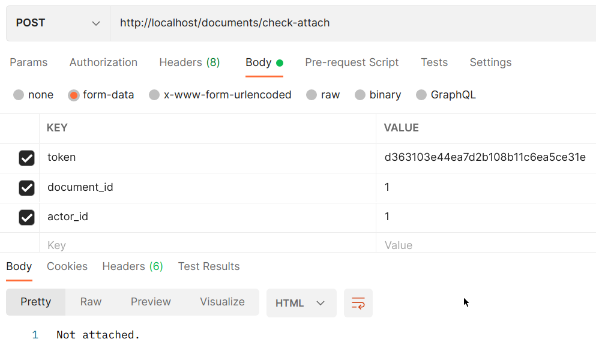
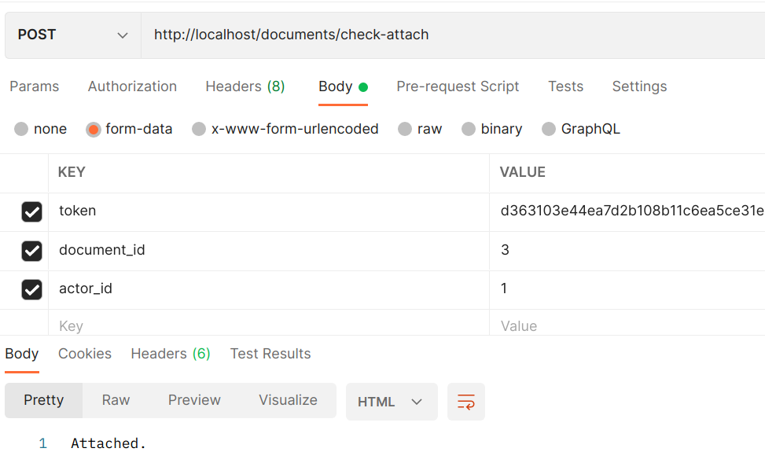
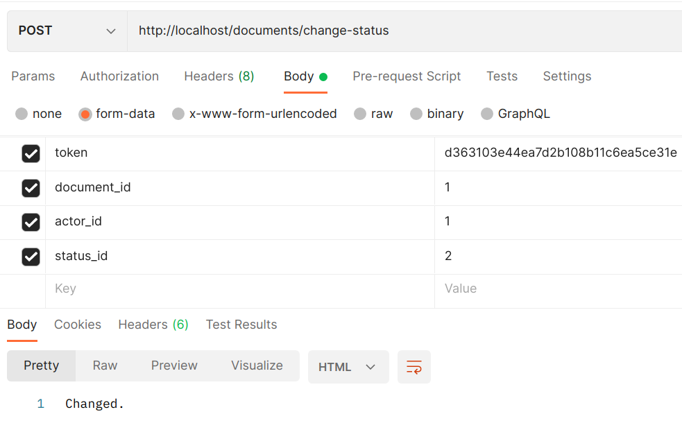
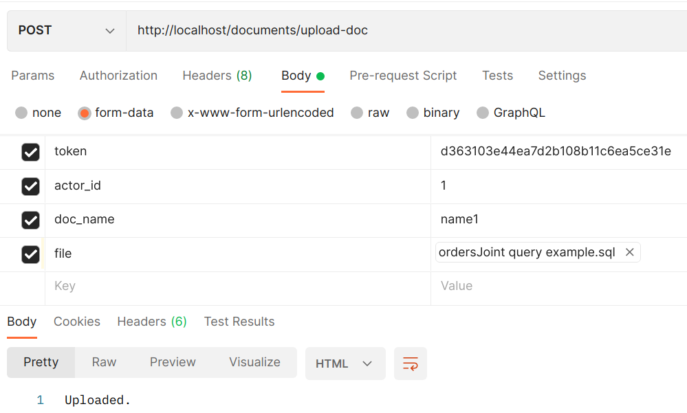

# logic-telecom-test

## Тестовое задание

Необходимо проанализировать и выполнить рефакторинг представленного фрагмента кода.
Готовое задание предоставить в виде репозитория на github/gitlab.

Представленный код необходимо привести в соответствие с современными практиками
и нормами (желательно не используя фреймворки). В идеале покрыть отрефакторенный код тестами.

Можно делать любые допущения по логике кода, но описывать их в readme репозитория.

```php
<?php

/**
 * Upload docs
 */
$doc=new Documents;
// Return array of privs with values is bool
$privs=priv( "DOC_TREE_1,DOC_TREE_2,DOC_TREE_3,DOC_SEE_ALL" );

$info_str='';
$with_errs=false;

if( isset($_POST["operation"]) && isset($_POST["el_id"]) && isset($_POST["actor_id"]) && $privs['DOC_SEE_ALL']) {
	if( $_POST["operation"]=="check_attach" ) {
        $in=["did"=>$_POST["el_id"], "actor_id"=>$_POST["actor_id"]];
        $db=DB::obj();
        $res=$db->query("SELECT * from documents where us_id=:actor_id AND id=:did", $in);
		if(!$res) $info_str='Not attached'; else $info_str='attached';
	}
	elseif( $_POST["operation"]=="change_status" ) {
        $in=["did"=>$_POST["el_id"], "actor_id"=>$_POST["actor_id"], "status_id"=>$_POST["status_id"]];
        $res=DB::obj()->query("UPDATE documents set id=:did, status_id=:status_id, us_id=:actor_id", $in  );
		if(!$res) $info_str="Not CHANGED"; else $info_str='changed';
	}
}
if( isset($_POST["operation"]) && $_POST["operation"]=='upload_doc' ){
	if(!$_FILES['upload_doc']['tmp_name']) {$info_str='Выберите файл'; goto ex;}
	$data=array(
		'us_id'=>auth('us_id')
		,'doc_name'=>$_POST['upload_type']
		,'file_name'=>$_FILES['upload_doc']['name']
		,'doc_content'=>file_get_contents($_FILES['upload_doc']['tmp_name'])
	);
    $db=DB::obj();
    $in=["p_us_id"=>$data['us_id'], "p_doc_name"=>$data['doc_name'], "p_file_name"=>$data['file_name'], "data_BLOB"=>$data['doc_content']];
    $res=$db->query("INSERT INTO documents (us_id,doc_name,file_name,data_blob,status_id) VALUES (:p_us_id,:p_doc_name,:p_file_name,:data_BLOB,'new')", $in );
    if(!$res) $info_str='Error upload doc'; else $info_str='uploaded';
}
ex:
if($info_str!='') echo $info_str;

```


## Решение
1. Склонировать репозиторий на локальную машину:
```
git clone https://github.com/yaroslavzinchenko/logic-telecom-test.git
```

2. Запустить
```
cd logic-telecom-test
docker compose up --build
```
3. Зайти на localhost:8000. Сервер mysql, логин root, пароль root.
Создать базу test. Импортировать файл test.sql
(лежит в корне проекта).

4. Запуск тестов
```
cd src
./vendor/bin/phpunit tests
```


В представленном тестовом примере был один файл, который обрабатывал
запросы, и в зависимости от входных параметров выполнял разные части кода.
Я написал небольшой MVC-фреймворк, после чего разложил логику по разным частям.
В тестовом примере идёт запрос по одному адресу, а логика работу зависит от
переданных переменных в $_POST. Я разбил логику так, чтобы запросы приходили по
разным адресам, соответственно каждый роут обслуживает свой кусок логики.
В тестовом примере происходит нагромождение логики в один файл.
Так как по условию можно делать любые допущения по логике кода,
я решил немного изменить архитектуру.
Входной точкой является index.php, который обрабатывает все входящие запросы.
index.php в зависимости от того, по какому адресу происходит обращение, передаёт
обработку в соответствующий контроллер (у меня он только один - DocumentsController).
Для работы с базой используется соответствующая модель.
Вывод информации клиенту происходит при помощи View.
Почему был написан свой фреймворк?
При разрастании проекта в любом случае потребуется оптимизация архитектуры решения,
поэтому лучше сразу структурировать код, чем заниматься этим потом.

В будущем можно добавить нормальную валидацию.

Какие допущеня были сделаны:
1. Строчка
```
$privs=priv( "DOC_TREE_1,DOC_TREE_2,DOC_TREE_3,DOC_SEE_ALL" );
```
Как я понял, представляла собой заглушку для разруливания прав доступа.
Я добавил файл auth/auth.php, в котором находится массив токенов и набор доступов
для каждого токена. При каждом запросе необходимо отправлять токен. По токену
будет происходить проверка, есть ли права на досуп к тому или иному действию.

Также в этой строке происходит, как я понял, генерация какого-то id, который
затем вставляется в БД.
```
'us_id'=>auth('us_id')
```

2. Были изменены названия столбцов в таблице documents, а также названия входных
переменных. Это было сделано для того, чтобы избавиться от путаницы во время
написания кода. Хотя я понимаю, что если бы мы рефакторили какой-то
продакшн-скрипт, то крайне желательно было бы сохранить как названия входных
параметров, так и названия столбцов в БД, так как и базой, и апи могут
пользоваться другие люди, у которых могут быть настроены интеграции с нашей
системой.


## Примеры отправки запросов (отправка форм датой)
1. ```http://localhost/documents/check-attach``` (проверяет, прикреплён ли файл)

```
token:d363103e44ea7d2b108b11c6ea5ce31e
document_id:1
actor_id:1
```




```
token:d363103e44ea7d2b108b11c6ea5ce31e
document_id:1
actor_id:3
```


2. ```http://localhost/documents/change-status``` (обновляет статус)

```
token:d363103e44ea7d2b108b11c6ea5ce31e
document_id:1
actor_id:1
status_id:2
```



3. ```http://localhost/documents/upload-doc``` (загружает данные)


